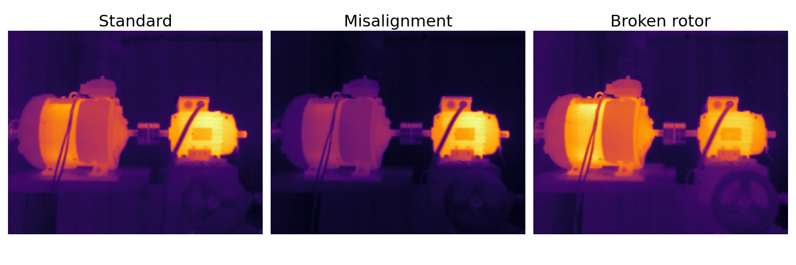
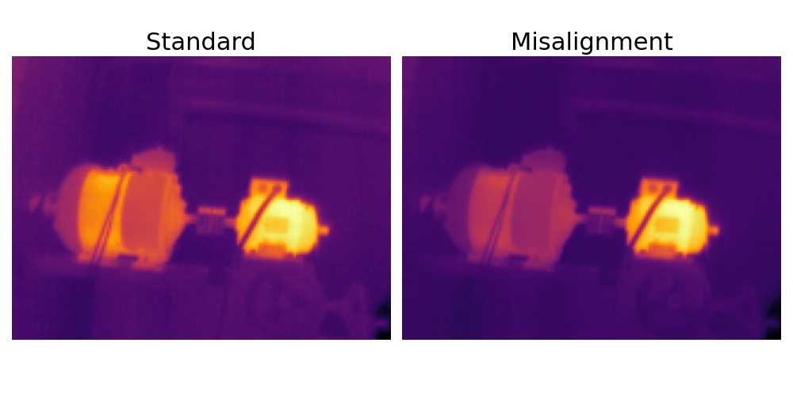
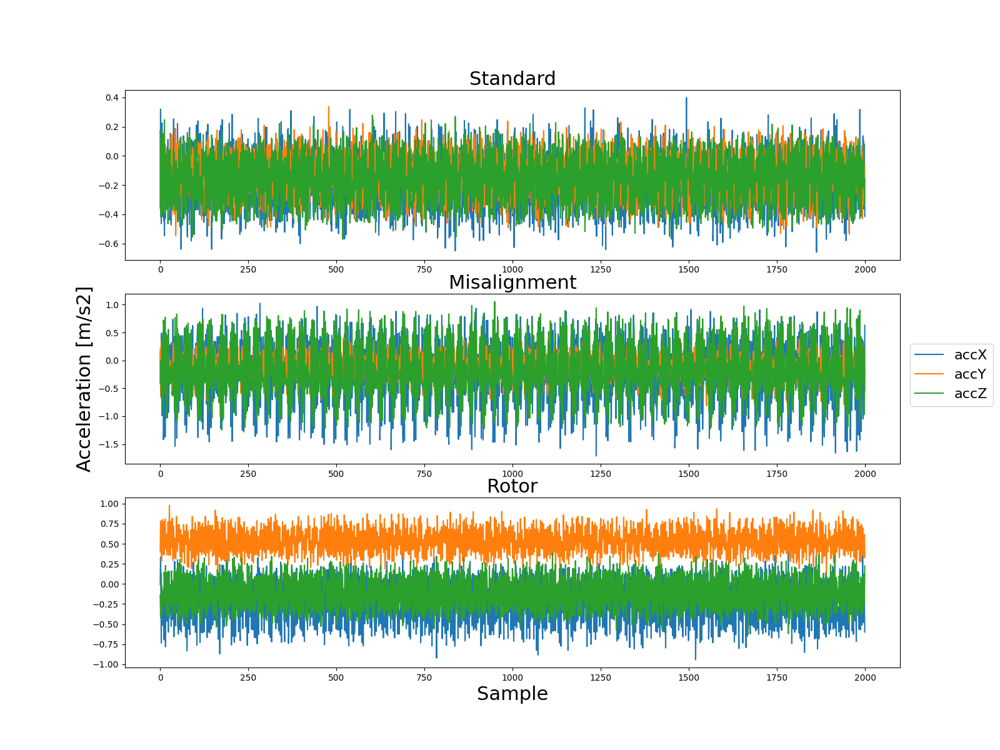

# Squirrel Cage Motor Anomaly Detection

<a rel="license" href="http://creativecommons.org/licenses/by/4.0/"></a><br /><span xmlns:dct="http://purl.org/dc/terms/" href="http://purl.org/dc/dcmitype/Dataset" property="dct:title" rel="dct:type">The Squirrel Cage Induction Motor Anomaly Dataset</span> is licensed under a <a rel="license" href="http://creativecommons.org/licenses/by/4.0/">Creative Commons Attribution 4.0 International License</a>.
It is a multi-sensor data collection gathered to expand research on anomaly detection, fault diagnosis, and predictive maintenance, mainly using non-invasive methods such as thermal observation or vibration measurement. In conducted research, the squirrel-cage rotor was utilized. Accompanying scripts and source code are licensed under a [MIT License](./LICENSE).

## Sensors

1. [Workswell InfraRed Camera (WIC) 640](https://workswell-thermal-camera.com/workswell-infrared-camera-wic/) with 640x512 px resolution.
2. [Flir Lepton 3.5](https://www.flir.com/products/lepton/?model=500-0771-01&vertical=microcam&segment=oem) (160x120 px resolution IR sensor) with [PureThermal 2 Smart I/O Module](https://cdn.sparkfun.com/assets/c/4/7/8/4/PureThermal_2_-_Datasheet_-_1.2.pdf)
3. [Triaxial DeltaTron Accelerometer Type 4506](https://www.bksv.com/en/transducers/vibration/accelerometers/ccld-iepe/4506-b-003)
4. [Arduino Nano 33 BLE Sense](https://docs.arduino.cc/hardware/nano-33-ble-sense) with [LSM9DS1](https://content.arduino.cc/assets/Nano_BLE_Sense_lsm9ds1.pdf) IMU and [MP34DT05](https://content.arduino.cc/assets/Nano_BLE_Sense_mp34dt05-a.pdf) Omnidirectional Digital Microphone.


## Dataset

The Squirrel Cage Motor Anomaly Detection dataset consists of several, simultaneously collected signals, such as:

<details close>
<summary>640x512 px thermal images in <i>workswell_wic_640</i> directory (Workswell WIC 640)</summary>
<p align="center">
  
</p>
</details>

<details close>
<summary>160x120 px thermal images in <i>flir_lepton_3_5</i> folder (Flir Lepton 3.5)</summary>
<p align="center">
  
</p>
</details>

<details close>
<summary>Current and voltage signals with XXX Hz sampling rate in <i>sig_*_R_U_W.tdms</i> files</summary>

</details>

<details close>
<summary>Vibration data with 1000 Hz sampling rate in <i>vib_*_R_U_W.tdms</i> files (Triaxial DeltaTron)</summary>
<p align="center">
  
</p>
</details>

<details close>
<summary>IMU data with 100 Hz sampling rate in <i>imu_*.cbor</i> files (LSM9DS1)</summary>
<p align="center">
  
</p>
</details>

<details close>
<summary>Microphone sound with 16 kHz sampling rate in <i>micro_*.json</i> files (MP34DT05)</summary>
<p align="center">
  
</p>
</details>

The dataset separates the use of different clutches and within them, experiments are split into 3 classes, according to the below description:
- `misalignment-X-*` - where `X` means a series of experiments with the same shift
- `rotor-X-*` - where `X` means the number of broken cages in the squirrel-cage rotor
- the other contains samples gathered during proper motor operation

All examinations were conducted with and without current load - in the range 0 - 6 A (`*-current-load-X`).

## **The collected data have open access and are available at [chmura.put.poznan.pl](https://chmura.put.poznan.pl/s/t1VhZlh9sOdyl4Z).**


## Extract data in Python

<details close>
<summary>Thermal images</summary>

```python
import matplotlib.pyplot as plt
import numpy as np
from PIL import Image


def normalize(data):
    return (data - data.min()) / (data.max() - data.min())


img_raw = np.asarray(Image.open(filepath), dtype=np.uint16)
img = normalize(img_raw)
plt.imshow(img, cmap='gray')
```
</details>

<details close>
<summary>LabVIEW tdms data</summary>

```python
import matplotlib.pyplot as plt
import pandas as pd
from nptdms import TdmsFile


tdms_file = TdmsFile.read(filepath)
df = tdms_file.as_dataframe()

df.plot()
```
</details>

<details close>
<summary>IMU cbor files</summary>

```python
import cbor2
import matplotlib.pyplot as plt
import numpy as np


with open(filepath, 'rb') as f:
    data = cbor2.decoder.load(f)

data = np.array(data['payload']['values'])
print(data.shape)

plt.plot(data)
```
</details>

<details close>
<summary>Microphone JSON files</summary>

```python
import json

import matplotlib.pyplot as plt
import numpy as np


with open(filepath, 'r') as f:
    data = json.load(f)

plt.plot(data['payload']['values'])
```
</details>


## Data acquisition

**TODO:** Update this section with more details.

<details close>
<summary>Vibration, current and voltage signals</summary>

Data was gathered using LabVIEW software.
</details>

<details close>
<summary>Thermal images recording</summary>

1. Run Workswell WIC node
```console
roslaunch workswell_wic_driver run.launch
```

2. Run node for FLIR Lepton 3.5
```console
roslaunch pure_thermal_driver run.launch
```

3. Record frames using the ROS rosbag tool
```console
rosbag record -a
```

4. Then from rosbag images were exported to PNG files.
</details>

<details close>
<summary>Arduino Nano 33 BLE Sense (IMU and Microphone)</summary>

1. Connect with Edge Impulse Deamon
```console
edge-impulse-daemon --clean
```

2. Select the project

3. Gather data using a browser
</details>
